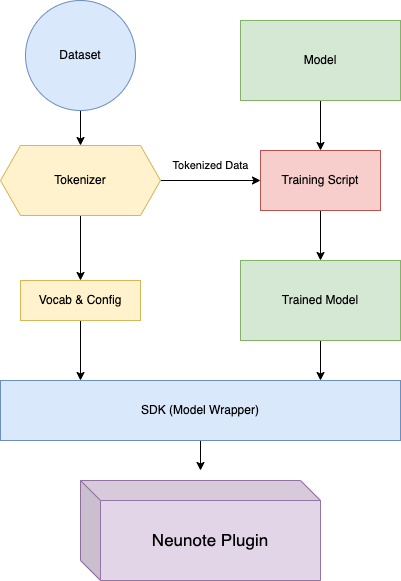

# Neutone-MIDI SDK

The goal of this SDK is to provide an environment where researchers, musicians and engineers
can quickly 'wrap' an existing machine-learning model for symbolic music tasks into a format that is deployed in a real-time
plugin for DAW's. 

There are two guides to help with this process:
1. model_training_guide: Details the setup you should follow 
in the training pipeline to ensure your model will be compatible
with the SDK
2. model_preparation_guide: how to export your model

Once your model is trained and serialized with the above 
methods, you will find the remaining instructions in this Readme 
to 'wrap' it for deployment in the Neunote-MIDI plugin. 

We have designed the SDK to work in conjunction with [MIDITok](https://github.com/Natooz/MidiTok), 
which lets you
tokenise an entire collection of MIDI files in a few easy commands. The SDK can convert the MIDI 
data in DAW's to and from this format, allowing your model to interact with the same data format that it was trained on. 



# Wrapping your model

Once you have a serialized a model trained on a supported tokenization format, it's time to wrap it!

**First, load your vocab and config files**
```angular2html
import torch
import json
from neunote_SDK import MidiToMidiBase
from data_preparation import prepare_token_data
from tokenization import TokenData

with open(vocab_file_path, 'r') as fp:
    vocab = json.load(fp)
with open(config_file_path, 'r') as fp:
    config = json.load(fp)
tokenizer_type = config["tokenization"]
```

Load your serialized model:
```
remi_Model = torch.jit.load("path_to_model")
```

Wrap it:
```angular2html
tokenizer_type = "REMI"
tokenizer_data: TokenData = prepare_token_data(tokenizer_type, vocab, config)
wrapped_model = MidiToMidiBase(model=remi_Model(),
                               vocab=tokenizer.vocab,
                               tokenizer_type=tokenizer_type,
                               tokenizer_data=tokenizer_data)
scripted_model = torch.jit.script(wrapped_model)
scripted_model.save('REMI_Model.pt')
```
And...that's it! Your model is now ready to deploy in the Neutone-MIDI Plugin. 


# SDK Components
### Neutone-MIDI SDK:

Provides the base wrapper for a MIDI-to-MIDI model, which is saved as a pytorch scripted .pt file


### Data Preparation
Each tokenization method has a particular set of quantized values that are available, 
related to pitch, timing, velocity, etc. Because sequence length often has a large impact 
on computational time, each model can use a slightly different granularity. To maintain efficiency,
it is helpful for the scripted model to have lists already identifying these available values. 

For example, if a midi message comes in with ``velocity=43`` and the available values are 
``[20, 40, 60, 80, 100, 120]`` then the tokenizer can quickly round the incoming velocity to the 
nearest value of ``40``. 

Given the original vocab json and the type of tokenization method, the data preparation utility
will return a tuple of dictionaries of lists of the relevant data values. As this can be accomplished during the
wrapping procedure, it saves the plugin the necessity to calculate available values on each forward pass. 


### MIDI Data Format

Input tensor will be dim of (x, 4) where x = number of midi messages. Each midi message will have type:

``{type, value, velocity, timestep}``

Current types:
```
0.0 = note on

1.0 = note off
```

``{0.0, 64.0, 90.0, 2.5}`` = note on, pitch of 64, velocity 90, at beat 2.5 

Every tokenization method is expecting this as an input, and will return it as an output

**Timing**: 

Within the C++ environment, timing is always expressed as **PPQ**, which is a float value in relation to quarter notes. 
Continuing off the above example '2.5' means an eight note (.5) after the second quarter note (2). MIDI can communicate time in a number of formats 
in varying resolutions; but the input and output must always adhere to this. as it determines where the plugin places MIDI events within the 
buffer. 

If, for example, your model uses a 'ticks-per-beat' system with a resolution of 96 ticks-per-quarter,
then it is the job of the tokeniser to convert from the PPQ to ticks system. All included tokenisation 
methods already take care of this functionality. 

